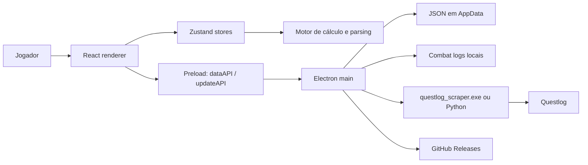

# Arquitetura e Guia de Evolução — Tier2 Command Lab

> Documento canônico para manutenção do aplicativo Electron. Atualizado a partir do código em julho de 2026.

## Escopo do produto

O **Tier2 Command Lab** é o aplicativo desktop Windows para importar builds do Questlog, calcular dano, comparar configurações, analisar combat logs e montar rotações. Ele é distribuído como instalador NSIS e recebe atualizações automáticas por GitHub Releases.

## Mapa da arquitetura



### Camadas e responsabilidades

| Camada | Diretório | Responsabilidade |
| --- | --- | --- |
| Interface | `src/pages/`, `src/components/` | Navegação, formulários, visualização e feedback ao jogador. |
| Estado | `src/store/` | Estado Zustand e persistência de builds, rotação, timeline, ranking, preferências e base de skills. |
| Domínio | `src/engine/` | Cálculo de DPS, sensibilidade, rotação, parsing de Questlog e combat logs, pontuação de equipamentos. |
| Catálogo | `src/data/` | Dados estáticos de skills, maestrias, aprimoramentos e catálogo. |
| Ponte segura | `electron/preload/index.ts` | Expõe somente as APIs IPC necessárias ao renderer. |
| Sistema | `electron/main/index.ts` | Arquivos, diálogos, scraper, auto-update, reporte e criação da janela. |
| Coleta e curadoria | `scripts/`, `tools/catalog-manager/` | Atualização do catálogo e manutenção dos dados do jogo. |

## Pontos de entrada

- `src/main.tsx`: inicializa React.
- `src/App.tsx`: compõe navegação, tema, migração, atualização e páginas.
- `electron/main/index.ts`: inicializa Electron, registra IPC, atualizador e janela.
- `electron/preload/index.ts`: contrato entre renderer e processo principal.
- `scripts/notify-discord.mjs`: notificação de release.

## Fluxos que exigem mais cuidado

### Importação de build

1. A tela **Builds** solicita `questlog:import-python` pela ponte preload.
2. O processo principal resolve o scraper nesta ordem: executável empacotado, executável de desenvolvimento, caminho configurado, ou script Python de fallback.
3. O scraper retorna JSON pelo `stdout`; o processo principal encaminha progresso e logs ao renderer.
4. `useBuilds` normaliza e grava a build em `builds.json` no diretório de dados do app.

O contrato de saída é compartilhado com o projeto Python `throne_and_liberty_agent`, especialmente `scraper/questlog_scraper_standalone.py`. Qualquer alteração no scraper deve manter os campos consumidos em `src/engine/types.ts` e os testes de contrato do projeto Python.

### Combat logs

1. O usuário escolhe uma pasta no diálogo do sistema.
2. O processo principal persiste o caminho em `settings.json`.
3. A listagem e a leitura aceitam apenas arquivos dentro dessa pasta; há proteção contra path traversal.
4. O renderer processa o conteúdo com `src/engine/logParser.ts` e armazena preferências/cortes em JSON local.

### Atualização do aplicativo

O `electron-updater` consulta o repositório GitHub configurado no `package.json`, baixa em segundo plano e comunica disponibilidade, progresso, conclusão e erro por `updateAPI`.

## Dados locais

O processo principal usa `app.getPath('userData')/data`. Os arquivos iniciais são `builds.json` e `settings.json`; outros stores podem criar arquivos próprios. Há migração única do diretório legado `throne-liberty/data`.

Dados do usuário não devem ser colocados em `src/data/`: essa pasta é conteúdo versionado do produto. Para uma nova persistência, crie um store responsável pelo arquivo e exponha uma operação IPC explícita, em vez de acessar Node no renderer.

## Contrato IPC

O renderer nunca deve importar `fs`, `child_process` ou APIs Electron diretamente. Toda nova capacidade deve seguir este caminho:

1. Validar a entrada e implementar o handler em `electron/main/index.ts`.
2. Expor uma função tipada em `electron/preload/index.ts`.
3. Declarar o contrato em `src/env.d.ts`.
4. Chamar a função pelo store ou componente apropriado.
5. Tratar cancelamento, falha e estado de carregamento na interface.

Os grupos existentes são:

| Grupo | Finalidade |
| --- | --- |
| `data:*` | Persistência JSON, importação/exportação e seleção de logs. |
| `combatlog:*` | Seleção, listagem, leitura e remoção de arquivos de combat log. |
| `scraper:*` | Configuração, diagnóstico, logs e reinstalação do scraper/Playwright. |
| `questlog:*` | Importação e cancelamento de build e importação por screenshot. |
| `update:*` | Consulta, progresso e instalação de atualização. |
| `report:send` | Envio de relato de erro. |

## Onde alterar cada funcionalidade

| Necessidade | Primeiro ponto a inspecionar |
| --- | --- |
| Fórmula ou métrica de DPS | `src/engine/calculator.ts` e `src/engine/types.ts` |
| Simulação de sequência/cooldown | `src/engine/rotationEngine.ts` e `src/store/useRotation.ts` |
| Leitura de logs | `src/engine/logParser.ts`, `src/pages/LogReader.tsx` e `src/store/useLogTimeline.ts` |
| Importação Questlog | `src/store/useBuilds.ts`, `electron/main/index.ts` e o scraper Python compartilhado |
| Dados de skills/maestrias | `src/data/` e scripts de catálogo; verificar consumidores antes de regenerar |
| Nova página | `src/pages/`, `src/App.tsx` e `src/components/Sidebar.tsx` |
| Configuração do usuário | `src/store/useSettings.ts` e handlers `data:*` |
| Instalador ou atualização | `package.json`, `electron/main/index.ts` e `scripts/notify-discord.mjs` |

## Rotina de desenvolvimento

```powershell
npm install
npm run dev
npm run build
```

Para gerar o instalador Windows:

```powershell
npm run package
```

O release de beta/produção exige, além do empacotamento, publicar uma GitHub Release com o `.exe` e `latest.yml` em `release/`, e então executar `npm run notify -- "Novidade"`.

## Checklist de mudança

- Atualize tipos e dados de exemplo antes da interface quando houver mudança de domínio.
- Para mudança de persistência, preserve migração e compatibilidade com JSON já salvo.
- Para nova operação IPC, valide o input no processo principal e atualize o tipo exposto no preload.
- Para mudar o scraper, valide manualmente importação, cancelamento e o retorno em caso de erro.
- Para alterar catálogo, execute os scripts de geração aplicáveis e confira telas de Skills, Maestrias e Rotation.
- Antes de release, valide build, instalador, importação Questlog e auto-update em uma instalação limpa.

## Riscos e melhorias priorizadas

1. **Cobertura automatizada:** não há testes `test`/`spec` detectáveis no app. Começar por testes puros do motor (`calculator`, `rotationEngine`, parsers) reduz risco sem depender de Electron.
2. **Contrato do preload:** `src/env.d.ts` declara apenas uma fração das funções usadas por `window.dataAPI`; tipar toda a API evita regressões de IPC em tempo de compilação.
3. **Segredos no cliente:** o webhook de reporte é definido durante o build do processo principal. Credenciais embutidas em binários distribuídos podem ser extraídas; migrar o recebimento de relatos para um endpoint autenticado ou rotacionar o webhook quando necessário.
4. **Sandbox do renderer:** a janela usa isolamento de contexto e desabilita Node, mas `sandbox` está desativado. Avaliar ativá-lo após validar compatibilidade do preload.
5. **Dependência externa:** a importação depende de formato e disponibilidade do Questlog e do scraper Python. O contrato compartilhado e fixtures de respostas devem ser tratados como parte do release.

## Decisões de manutenção

- O processo principal é a única autoridade para caminhos de arquivo e subprocessos.
- O catálogo em `src/data/` é a fonte do app; alterações manuais devem ser evitadas quando houver script de geração correspondente.
- O projeto Python é uma dependência de desenvolvimento e fallback do scraper, não uma dependência instalada junto ao usuário quando `resources/questlog_scraper.exe` está presente.
